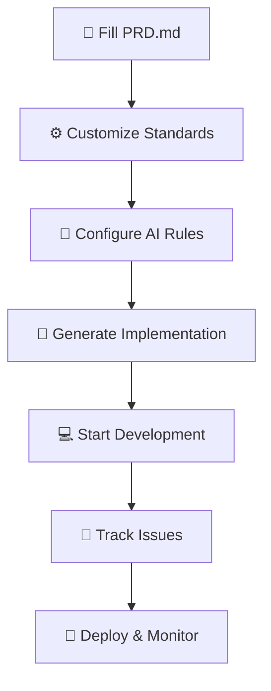

# CONTEXT WORKFLOW - AI-Powered Development Framework

A comprehensive workflow system that transforms Product Requirements Documents (PRDs) into actionable implementation plans using AI assistance.

## 🎯 What is Context Workflow?

Context Workflow is a structured approach to software development that:

- **Transforms ideas into action** - Convert PRDs into detailed implementation plans
- **Ensures consistency** - Maintain project standards across all development phases
- **Accelerates development** - Leverage AI to generate comprehensive technical documentation
- **Prevents common issues** - Built-in best practices and error tracking

## 🚀 Quick Start Guide

### Step 1: Define Your Project

**Fill out the PRD.md file**

- Describe your project vision and objectives
- List core features and requirements
- Define success metrics and constraints
- Use the provided template and examples

### Step 2: Customize Your Standards

**Review and adapt these files to your project needs:**

📁 **Project_structure.md**

- Modify folder organization patterns
- Adapt to your tech stack (React, Vue, Angular, etc.)
- Update file naming conventions

🎨 **UI_UX_doc.md**

- Customize color palettes and design tokens
- Add your brand guidelines
- Modify component patterns for your design system

🐛 **bugs_tracking.md** _(optional)_

- Adapt bug reporting templates
- Customize priority levels and categories
- Add project-specific debugging tools

### Step 3: Configure AI Rules

**Check and adapt the workflow rules:**

- Review `.cursor/rules/workflow.mdc`
- Update if you changed project structure
- Ensure rules match your development preferences

### Step 4: Generate Implementation Plan

**Use your AI model to create the implementation roadmap:**

```
Prompt: "Generate the Implementation.md file using the generate.mdc rules"
```

The AI will analyze your PRD and create:

- ✅ Feature breakdown and prioritization
- 🛠️ Technology stack recommendations
- 📋 Stage-by-stage implementation plan
- 🎯 Success metrics and testing guidelines

### Step 5: Start Development

**Begin coding with your AI assistant:**

```
Prompt: "Let's start with Stage 1 of the implementation plan"
```

## 📋 Alternative: Lite Version

For beginners or simpler projects, use the lite version:

1. Rename `generate-lite-version.mdc` to `generate.mdc`
2. This version provides:
   - Simplified instructions
   - More guidance for beginners
   - Streamlined decision-making process

## 🔄 Workflow Overview



## 📁 Project Structure

```
CONTEXT_WORKFLOW/
├── 📄 PRD.md                    # Product Requirements Document
├── 📄 README.md                 # This file
├── 📁 Documentations/
│   ├── 📄 Implementation.md     # Generated implementation plan
│   ├── 📄 Project_structure.md  # Folder organization guide
│   ├── 📄 UI_UX_doc.md         # Design system documentation
│   └── 📄 bugs_tracking.md     # Bug tracking templates
└── 📁 .cursor/rules/
    ├── 📄 generate.mdc          # AI generation rules
    └── 📄 generate-lite-version.mdc # Simplified version
```

## 🎯 Key Benefits

### For Developers

- **Faster project setup** - Skip the planning phase confusion
- **Consistent code quality** - Built-in best practices
- **Better documentation** - Auto-generated, comprehensive guides
- **Reduced debugging time** - Structured error tracking

### For Teams

- **Shared understanding** - Clear project vision and standards
- **Scalable processes** - Works for small projects to enterprise apps
- **Knowledge retention** - Document decisions and solutions
- **Onboarding efficiency** - New team members get up to speed quickly

### For Project Managers

- **Clear milestones** - Stage-by-stage implementation tracking
- **Risk mitigation** - Identify potential issues early
- **Resource planning** - Realistic timelines and requirements
- **Quality assurance** - Built-in testing and validation steps

## 🛠️ Supported Technologies

The workflow is flexible and supports various tech stacks:

### Frontend

- ⚛️ React (Next.js, Vite, CRA)
- 🖖 Vue.js (Nuxt.js, Vite)
- 🅰️ Angular
- 📱 React Native / Flutter
  ......

### Backend

- 🟢 Node.js (Express, Fastify, NestJS)
- 🐍 Python (Django, FastAPI, Flask)
- ☕ Java (Spring Boot)
- 🦀 Rust (Axum, Actix)

---

### Databases

- 🐘 PostgreSQL
- 🍃 MongoDB
- 🔥 Firebase
- 🏠 SQLite
  .....

## 📚 Documentation Files Explained

### 📄 PRD.md

**Your project's foundation**

- Project vision and objectives
- Feature requirements and priorities
- Success metrics and constraints
- Target audience and use cases

### 📄 Implementation.md

**Generated roadmap** (created by AI)

- Technology stack selection
- Feature breakdown by priority
- Stage-by-stage development plan
- Testing and deployment guidelines

### 📄 Project_structure.md

**Code organization guide**

- Folder structure examples
- File naming conventions
- Import/export patterns
- Best practices for scalability

### 📄 UI_UX_doc.md

**Design system documentation**

- Color palettes and typography
- Component design patterns
- Responsive design guidelines
- Accessibility standards

### 📄 bugs_tracking.md

**Issue management system**

- Bug reporting templates
- Priority and category definitions
- Solution documentation
- Prevention strategies

## 🤖 AI Integration Tips

### Best Prompts for Generation

```
✅ Good: "Generate Implementation.md using the PRD and project structure guidelines"
❌ Avoid: "Make me a plan"

✅ Good: "Start Stage 1 implementation focusing on authentication setup"
❌ Avoid: "Code something"
```

### Effective AI Collaboration

WIP

## 🚨 Common Issues & Solutions

WIP

## 🔧 Customization Guide

WIP

## 🏁 Ready to Start?

1. **Clone this repository**
2. **Fill out PRD.md** with your project details
3. **Customize the documentation files** to match your needs
4. **Generate your implementation plan** using AI
5. **Start coding** with confidence!

**Happy coding! 🚀**

---

EYS
